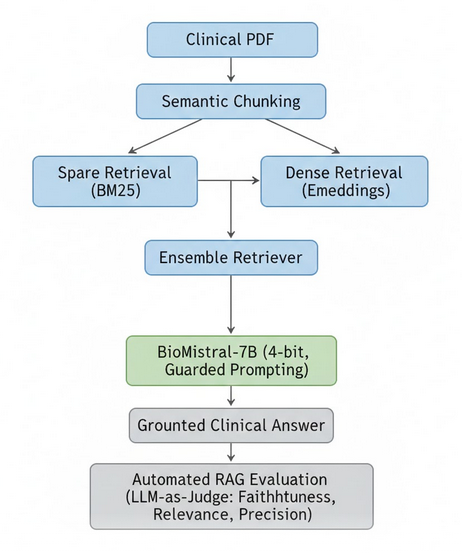
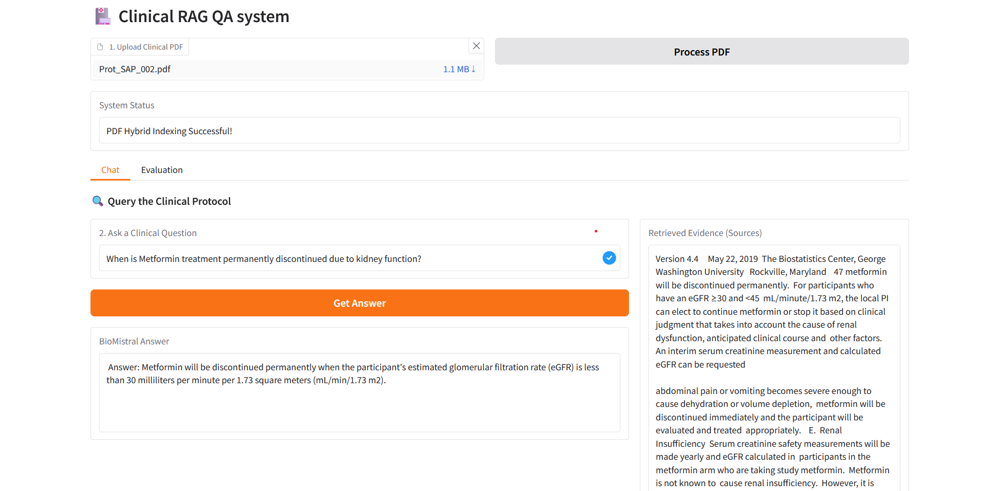
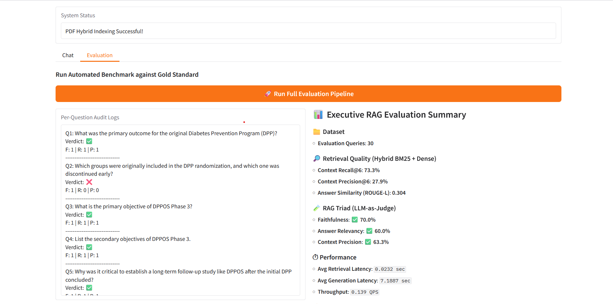
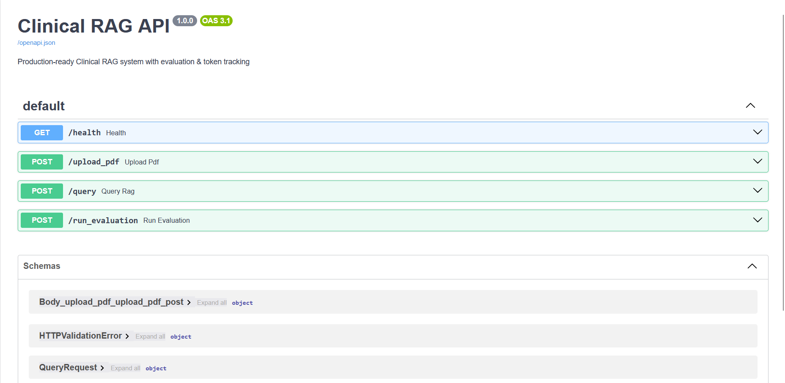
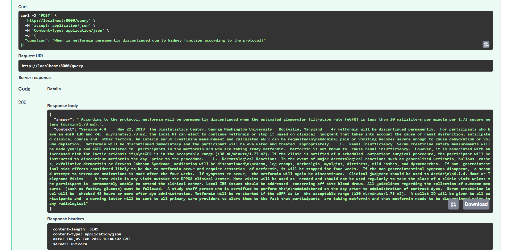

# Clinical Document Question-Answering System (Production RAG)


A production-grade Retrieval-Augmented Generation (RAG) system for querying clinical protocols using large language models, hybrid retrieval, and automated evaluation.
Designed for low-latency inference, safe medical responses, and real-world deployment.

## Key Highlights

- Hybrid RAG pipeline (BM25 + dense embeddings) for robust clinical document retrieval
- LLM guardrails + automated RAG evaluation (Faithfulness, Relevance, Precision)
- FastAPI deployment with real-time PDF ingestion and inference endpoints
- Optimized for low VRAM GPUs (4-bit quantization, memory-mapped loading)
- End-to-end evaluation pipeline producing resume-ready metrics
- Interactive UI (Gradio) for transparency and debugging
- This project simulates how production clinical AI systems are built, evaluated, and deployed.

## System Architecture



## Demo: Clinical Question Answering ()

**Interactive Clinical Q&A Interface (Gradio)**  
Real-time question answering over clinical protocols using a hybrid RAG pipeline.  
Each response is grounded in retrieved protocol sections, with source context displayed for transparency and clinical safety.



- Upload clinical protocols
- Ask questions with retrieved evidence shown
- Run evaluation pipeline interactively
- Inspect RAG behavior and failure modes


## Core Features
- Retrieval-Augmented Generation: Hybrid retrieval using BM25 + dense embeddings, Chroma vector database, Domain-specific embeddings (PubMed / clinical)
- LLM Guardrails: Strict context-only answering, Refusal when evidence is missing, Low-temperature decoding for medical safety
- Automated Evaluation (RAGAS-style) :
Faithfulness – Is the answer grounded in retrieved context?
Answer Relevancy – Does it address the clinical question?
Context Precision – Does retrieval include gold evidence?
ROUGE-L for linguistic similarity
Retrieval Precision@k / Recall@k
- Performance Optimization: 4-bit quantization (BitsAndBytes), Memory-mapped loading for 6GB GPUs, Sub-7s end-to-end inference latency, Token usage & throughput tracking

# Evaluation summary

Evaluated on 30 gold-standard clinical protocol questions using a hybrid retrieval + LLM-as-a-judge framework.
 
**Evaluation tab**



Failures are dominated by retrieval misses or partial answers, not hallucinations — a deliberate safety-first design choice for clinical AI.

## FastAPI Deployment (Production-Ready)

**Interactive API docs with clear endpoint structure**



**Grounded clinical answers from the API, including context retrieval.** 




| Endpoint            | Description                        |
|--------------------|------------------------------------|
| GET /health         | System health check                |
| POST /upload_pdf    | Upload and index clinical PDF      |
| POST /query         | Real-time clinical Q&A             |
| POST /run_evaluation| Run automated benchmark            |


Run API
```bash
uvicorn api:app --host 0.0.0.0 --port 8000
```
Swagger UI
```
http://localhost:8000/docs
```

## Technology Stack

- LLMs :BioMistral-7B (4-bit quantized)
- Retrieval : BM25, Chroma Vector DB, PubMed embeddings
- Frameworks: LangChain, FastAPI, Gradio
- Evaluation: LLM-as-Judge (RAG Triad), ROUGE-L, Precision@k / Recall@k
- Optimization: BitsAndBytes, Memory-mapped inference

## Project Structure

```bash
Clinical-RAG-QA-system/
│
├── app.py                     # Gradio UI entrypoint
├── README.md                  
├── requirements.txt
├── .gitignore
│
├── config/
│   └── settings.py            # device, model names, constants
│
├── core/
│   ├── models.py              # load_models, tokenizer, llm_chain
│   ├── retriever.py           # PDF processing + hybrid retriever
│   ├── qa.py                  # ask_question
│
├── evaluation/
│   ├── metrics.py             # metrics
│   ├── evaluator.py           # evaluate_single_query
│   ├── benchmark.py           # run_rag_benchmark, summaries
│
├── data/
│   ├── gold_dataset.py        # GOLD_DATASET
│   └── sample_protocol.pdf    # optional demo file
│
├── artifacts/
│   ├── evaluation_logs.txt
│
└── screenshots/
    ├── Gradio_chatTab.png
    ├── Gradio_eval.png
    ├── FastAPI.png
    ├── FastAPI_query.png
```


## Why This Project Matters

It demonstrates:
- Real-world RAG system design
- Safe deployment of LLMs in high-risk domains
- Evaluation beyond accuracy (faithfulness & grounding)
- Engineering trade-offs for low-resource hardware
- End-to-end ML system ownership


## Future Improvements
- Cross-encoder reranking for retrieval
- Dynamic chunking based on query type
- Prompt injection prevention
